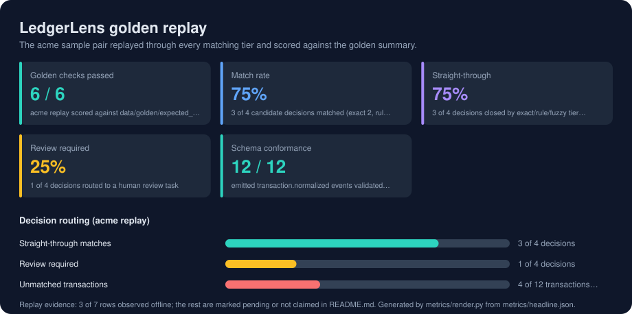

# LedgerLens

**AI-assisted reconciliation that reconciles cheaply first, reasons expensively last, and explains every decision.**

A reconciliation engine for messy client files: deterministic matching where rules are stronger, fuzzy scoring
for the middle band, a language model reserved for genuinely ambiguous pairs behind a structured, cost-capped
and masked contract, and a review gate that pauses the run at a real LangGraph `interrupt()` until a person has
resolved every task. Runs offline with a deterministic adjudicator bound by default, so every test and demo is
reproducible without a key; Ollama, vLLM, Bedrock and Anthropic sit behind the same contract when a live model
is wanted.

---

## At a glance

| | |
|---|---|
| **The problem** | Reconciliation teams compare bank statements, ledger exports and processor files that never share a schema, a sign convention or a posting date. Automating the obvious matches is easy; the cost is in the gray area, and an LLM on every pair is neither affordable nor auditable. |
| **What it does** | Config-driven source onboarding, raw-row provenance, canonical normalisation, source quality diagnostics, tiered matching, masked LLM adjudication with persistent pair caching, a LangGraph review gate with SQLite checkpoints, an MCP review server, exception reporting, atomic runs with rollback, and event export for a Go/Kafka sidecar. |
| **Stack** | Python 3.11, SQLite, LangGraph with SQLite checkpoints, the `mcp` SDK, a stdlib matching engine and JSON API, JSON Schema event contracts, a Go match worker, Docker, an optional Redpanda streaming profile. |
| **Validation** | `make check`: unit, contract, golden and end-to-end tests, the offline golden replay and the results-card drift guard. Beyond it: CLI demo smoke; Dockerised Go worker tests; worker image build; real Python-exported events replayed through the Go worker; Compose validation; optional Redpanda round trip. |

<!-- metrics:start -->

## Results



Every figure below was observed by `make golden`, which runs offline with a fixed seed and no API key, and writes `metrics/headline.json`. The acme sample pair replayed through every matching tier, paused at the review gate, resolved as a human and completed by a second workflow instance. Rows marked *pending* need hardware, data or a service the offline harness does not have; nothing here is estimated.

| Metric | Value | How it was measured |
|---|---|---|
| Golden checks passed | **6 / 6** | acme replay scored against data/golden/expected_summary.json |
| Match rate | **75%** | 3 of 4 candidate decisions matched (exact 2, rule 1) |
| Straight-through | **75%** | 3 of 4 decisions closed by exact/rule/fuzzy tiers without review |
| Review required | **25%** | 1 of 4 decisions routed to a human review task |
| Schema conformance | **12 / 12** | emitted transaction.normalized events validated against contracts/schemas (Draft 2020-12, structural) |
| Review gate | **1 / 1** | run paused at await_review with 1 open task(s); resumed by a second workflow instance after human resolution; final report carries the human decision |

**Decision routing (acme replay)**

| | | |
|---|---|---|
| Straight-through matches | `███████████████░░░░░` | 3 of 4 decisions |
| Review required | `█████░░░░░░░░░░░░░░░` | 1 of 4 decisions |
| Unmatched transactions | `███████░░░░░░░░░░░░░` | 4 of 12 transactions (2 bank, 2 ledger) |

**Replay evidence**

| | Status | Evidence |
|---|---|---|
| Samples replayed | observed | acme_bank_statement.csv (6 rows) + acme_ledger_export.csv (6 rows) -> 12 normalized transactions |
| Samples without a profile | pending | bank_statement.csv, ledger_export.csv: no profile under configs/clients maps their headers, so they were not replayed |
| Precision / recall / F1 | pending | expected_summary.json carries aggregate thresholds only; no per-pair match labels to score against |
| Contract fixtures validated | observed | 12 of 12 events under contracts/events pass their declared schema |
| Fake-LLM adjudications | observed | calls 1, cache hits 0 (DeterministicFakeLLM, offline) |
| LangGraph checkpoints | observed | 15 checkpoints for the gated run in the run database (SqliteSaver, thread_id = run_id); every step replayable with graph-history |
| Cross-instance resume | observed | status awaiting_review at the interrupt; 1 task(s) resolved as a human; a second workflow instance completed the review -> completed |
| MCP review tools | observed | 5 of 7 tools called over an in-memory MCP session; 0 raw counterparty/reference strings from the samples leaked |
| Payload masking | observed | 3 of 3 sensitive fields per side tokenised or redacted (reference, counterparty, description) under ledgerlens.masking.v1, for the model and for MCP |
| Live LLM adjudication | pending | openai_compat (Ollama, vLLM), bedrock and anthropic adapters ship behind the same contract; the harness runs the deterministic fake with no key, so live accuracy is not measured |
| Go match-worker candidates | pending | not executed by this harness; covered by go test in go/match-worker |

<!-- metrics:end -->

## How matching works

```
                exact fingerprint ─────────────────► matched
                        │ miss
                deterministic rules ───────────► matched        (date lag, reference variants,
                        │ miss                                   sign conventions)
                fuzzy scoring ──┬─ high ───────► matched
                                ├─ low ────────► unmatched exception
                                └─ middle band ─► LLM adjudication (masked, cached per pair, cost-capped)
                                                         │
                                                  confident ──► matched
                                                  unsure ─────► human review task
                                                                       │
                persist_decisions ─► generate_report ─► await_review   (interrupt: run is awaiting_review)
                                                            │ every task resolved, review completed
                                                       finalize_run ──► completed
```

Each tier only sees what the previous one declined. Adjudications are cached by pair in SQLite, so re-running a
reconciliation never pays twice for the same question. The report states how many pairs the model saw, how many
it did not need to, and what that saved. The tiers and the gate are one LangGraph `StateGraph` checkpointed to
the run database: a run's status moves `created -> awaiting_review -> completed`, or straight to `completed`
when no review task was raised.

## Quick start

```bash
python -m ledgerlens.cli --db .ledgerlens/ledgerlens.db demo
```

That ingests two sample sources, reconciles them across every tier, opens a review task for the ambiguous pair,
prints the preliminary report and stops at the gate. The output ends with:

```
Run ID: run_0f891164c16a
Status: awaiting_review
```

Finish the run the way a reviewer would:

```bash
python -m ledgerlens.cli --db .ledgerlens/ledgerlens.db review-list --run-id <run_id>
python -m ledgerlens.cli --db .ledgerlens/ledgerlens.db review-resolve <task_id> \
  --decision no_match --notes "Different business event." --reviewer analyst
python -m ledgerlens.cli --db .ledgerlens/ledgerlens.db review-complete <run_id> --reviewer analyst
python -m ledgerlens.cli --db .ledgerlens/ledgerlens.db graph-history <run_id>
python -m ledgerlens.cli --db .ledgerlens/ledgerlens.db run-status <run_id>
```

`review-complete` refuses while any task is open (`still has 1 open review task(s); resolve them first`) and
otherwise prints the final report, which now carries a `human:no_match` decision and a `run.finalized` audit
event. `graph-history` lists the checkpoints of the run oldest first, fifteen for the gated demo, and
`run-status` shows `completed` with no open tasks.

To reconcile your own files, give each source a mapping profile:

```bash
python -m ledgerlens.cli --db .ledgerlens/ledgerlens.db reconcile \
  --client-id acme \
  --source data/samples/acme_bank_statement.csv configs/clients/acme_bank.json \
  --source data/samples/acme_ledger_export.csv configs/clients/acme_ledger.json
```

Profiles in `configs/clients/` describe column mappings, date formats, debit/credit strategy, reference extraction patterns and description stopwords. Onboarding a new source is configuration plus a focused test, not code.

## The review gate

A run with open review tasks is not finished, and 0.1 marked it `completed` anyway. In 0.2 the `await_review`
node calls LangGraph's `interrupt()`. Rows, review tasks and checkpoints commit together at that point, the run
status becomes `awaiting_review`, and the process may exit.

An interrupt rather than a status flag because the checkpointer makes the pause resumable from anywhere.
`review-complete`, `POST /runs/{id}/review/complete` and the MCP `complete_review` tool all call one service
method that opens a fresh workflow on the same database and resumes the thread. Before resuming, the service
checks that the run is `awaiting_review`, that no task is open and that a reviewer is named. The check lives
outside the graph because LangGraph persists the resume value before the node runs; a node that raised on a bad
payload would wedge the thread.

`finalize_run` re-reads decisions and review tasks from the store, appends a `run.finalized` audit event,
regenerates the report so the `human:` decisions appear in it, and sets the status to `completed`. Checkpoints
hold ids and counters only; the store is the record and the checkpoint is the cursor. The gate finalises the
run, it does not re-adjudicate. Design and numbered decisions:
[`docs/05-langgraph-review-gate-design.md`](docs/05-langgraph-review-gate-design.md).

## Local or cloud models

`--llm fake|ollama|vllm|bedrock|anthropic` on `demo` and `reconcile` selects the adjudicator; `fake` is the
default and the only backend the tests and the golden replay use. Each name is a file in `configs/llm/` holding
the backend, the model, a base URL or region, and the *name* of the environment variable that carries the key
(`VLLM_API_KEY`, `ANTHROPIC_API_KEY`; Ollama needs none; Bedrock uses the AWS credential chain). No secret is
read from any file. Ollama and vLLM speak through the stdlib `urllib` with nothing extra to install; Bedrock and
Anthropic are optional extras (`pip install -e ".[bedrock]"`, `".[anthropic]"`) imported lazily, and a missing
package or variable raises `LLMError` naming what to install or set.

Every payload that leaves the engine passes through `ledgerlens/llm/masking.py`. A live model sees, per side,
`id`, `date`, `amount`, `currency` and `source_system` verbatim, a description with digit runs of five or more
replaced by `#` and capped at 80 characters, and stable hashed tokens in place of the reference and the
counterparty, plus the engine's computed features and the matching policy. It never sees a raw counterparty, a
raw reference, an unmasked description or a source row. Live and fake decisions never share a cache row because
the model family is part of the cache key. The adapters are tested against fake transports; no live model has
been run by the harness, so live accuracy is pending.

## MCP review server

`python -m ledgerlens.cli mcp` (also `ledgerlens mcp` or `python -m ledgerlens.mcp.server`) starts
`ledgerlens-review` over stdio against the database named by `LEDGERLENS_DB`. Seven tools let Claude Desktop,
Cursor, Claude Code or a script list runs, read review tasks, inspect a masked candidate pair with the machine's
reason and confidence, resolve a task with a named reviewer and non-empty notes, complete the review and read
the report. The same masking module serves the model and the reviewer, and `complete_review` is refused while
tasks are open, so the gate holds across the MCP boundary too. Registration snippets and a transcript:
[`docs/mcp.md`](docs/mcp.md).

## Tests

One gate runs everything offline:

```bash
make check
```

That is `make test` (unit, contract, golden and end-to-end suites), `make golden-check` (the offline replay
that writes `metrics/headline.json`, then its schema and determinism self-check) and `make card-check` (fails
when the README results block or `docs/assets/metrics.svg` drifts from that file). CI runs the same steps and
also fails if the regenerated `metrics/headline.json` differs from the committed one. The suite alone:

```bash
python -m unittest discover -s tests
```

The full verifier adds the Docker-backed gates when Docker is present, and can be told to require them:

```bash
python scripts/verify.py
python scripts/verify.py --docker required
python scripts/verify.py --docker required --kafka-smoke   # optional Redpanda round trip
```

It runs the Python tests, a CLI demo smoke, the Go worker tests, a worker image build, a containerised file-mode smoke fed with events exported from a real Python run, and Compose validation.

## API

```bash
python -m ledgerlens.cli --db .ledgerlens/ledgerlens.db serve --port 8080
```

| Endpoint | Purpose |
|---|---|
| `POST /demo` | Run the bundled demo; optional `{"client_id", "llm"}` |
| `POST /runs` | Reconcile a custom source pair |
| `GET /runs/{run_id}` | Run record, status and open review task count |
| `GET /runs/{run_id}/report` | The Markdown report |
| `GET /runs/{run_id}/events/normalized` | Normalised events for sidecar replay |
| `GET /runs/{run_id}/graph/history` | LangGraph checkpoints of the run, oldest first |
| `GET /review/tasks?run_id=…&status=open` | Open human-review tasks |
| `POST /review/tasks/{task_id}/resolve` | Resolve a task, with an audit event |
| `POST /runs/{run_id}/review/complete` | `{"reviewer", "note"}`; resumes the gate. 409 while tasks are open or no reviewer, 404 unknown run |

## The Go sidecar and the streaming profile

`go/match-worker` consumes normalised-transaction events and emits candidate pairs. It runs in file mode for cheap local demos and in Kafka mode against the optional Redpanda profile:

```bash
docker compose --profile streaming up
```

Kafka offsets are committed only after candidate events are written. Event contracts live in `contracts/schemas/` as JSON Schema, with fixtures in `contracts/events/fixtures/`, and both the Python exporter and the Go consumer are tested against them. Verifying the worker needs no local Go toolchain:

```bash
docker run --rm -e GOWORK=off -v "${PWD}:/repo" -w /repo/go/match-worker golang:1.23-alpine go test ./...
docker build -t ledgerlens-match-worker:test ./go/match-worker
```

## Documentation

| | |
|---|---|
| [`docs/OVERVIEW.md`](docs/OVERVIEW.md) | The problem, the design and its reasons, what is measured |
| [`docs/SHOWCASE.md`](docs/SHOWCASE.md) | A guided tour of every feature, with the commands and files |
| [`docs/01-high-level-design.md`](docs/01-high-level-design.md) | Architecture and component boundaries |
| [`docs/02-low-level-multi-agent-design.md`](docs/02-low-level-multi-agent-design.md) | The bounded workflow, contracts and the adjudication boundary |
| [`docs/03-demo-runbook.md`](docs/03-demo-runbook.md) | Running and operating the demo |
| [`docs/04-functionality-real-world-ai-brief.md`](docs/04-functionality-real-world-ai-brief.md) | Feature catalogue and the real-world framing |
| [`docs/05-langgraph-review-gate-design.md`](docs/05-langgraph-review-gate-design.md) | The 0.2 graph, review gate, masking, live backends and MCP server, with numbered decisions |
| [`docs/mcp.md`](docs/mcp.md) | Registering and using the MCP review server |
| [`docs/graph/README.md`](docs/graph/README.md) | The offline code knowledge graph (graphify): how to build it and query it |

## Live model

No key is required for anything in this repository. Three live backends exist behind the fake adjudicator's
contract (`openai_compat` for Ollama and vLLM, `bedrock`, `anthropic`) and are selected with `--llm`. Their
transports are tested with fakes; the results card lists live adjudication as pending because the harness runs
the deterministic fake and no live run has been recorded. Turning a live model on is a config file and an
environment variable, never a side effect of having a key present.
