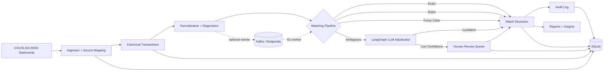

# LedgerLens High-Level Design

Status: Design proposal  
Date: 2026-08-24  
Project: LedgerLens, an AI-driven reconciliation agent

## 1. Executive Summary

LedgerLens reconciles financial transactions by using the cheapest reliable technique first and escalating only when necessary:

1. Exact fingerprint matching for obvious matches.
2. Deterministic rule matching for known accounting patterns.
3. Fuzzy candidate scoring for messy descriptions, delayed posting dates, fees, and inconsistent references.
4. LLM adjudication only for ambiguous candidate pairs.
5. Human review for low-confidence, high-risk, or policy-sensitive decisions.

The portfolio story is intentionally pragmatic: LedgerLens is not an LLM demo pretending to be a finance system. It is a finance-grade workflow that uses AI where it creates leverage, preserves auditability, and demonstrates production judgment.

## 2. Market And Hiring Signal

The design is based on current finance automation and enterprise AI trends as of 2026-08-24.

Key signals:

- Finance teams are prioritizing transformation and automation. Deloitte's Q4 2025 CFO Signals press release says 50% of North American CFOs cite digital finance transformation as a top 2026 priority, 49% cite automation that frees employees for higher-value work, 87% expect AI to be extremely or very important to finance operations, and 54% say integrating AI agents in finance will be a transformation priority. Source: https://www.deloitte.com/us/en/about/press-room/deloitte-q4-2025-cfo-signals-survey.html
- Enterprise software is moving toward task-specific agents. Gartner predicts 40% of enterprise applications will include task-specific AI agents by the end of 2026, up from less than 5% in 2025. Source: https://www.gartner.com/en/newsroom/press-releases/2025-08-26-gartner-predicts-40-percent-of-enterprise-apps-will-feature-task-specific-ai-agents-by-2026-up-from-less-than-5-percent-in-2025
- Agentic projects fail when cost, controls, and business value are weak. Gartner also predicts over 40% of agentic AI projects will be canceled by the end of 2027 due to escalating costs, unclear business value, or inadequate risk controls. Source: https://www.gartner.com/en/newsroom/press-releases/2025-06-25-gartner-predicts-over-40-percent-of-agentic-ai-projects-will-be-canceled-by-end-of-2027
- Kafka is credible for event-driven financial workflows because event streaming captures, stores, processes, and routes events in real time, with Apache's own examples including payments and financial transactions. Kafka supports scalable, fault-tolerant clients across languages including Go and Python. Source: https://kafka.apache.org/43/getting-started/introduction/
- LangGraph is a good fit for bounded AI workflows because its persistence supports resumable graph state, and interrupts support human-in-the-loop pauses. Sources: https://docs.langchain.com/oss/python/langgraph/persistence and https://docs.langchain.com/oss/python/langgraph/interrupts
- SQLite is acceptable for a portfolio-scale local system because WAL mode allows readers and a writer to proceed concurrently, while preserving a low-ops demo footprint. Source: https://www.sqlite.org/wal.html
- Go is a strong fit for concurrent workers and network services; official Go docs call out goroutines and channels as simple primitives for concurrent execution. Source: https://go.dev/doc/

Forward Deployed Engineering signal:

- The project should look deployable into a messy client environment, not only into a clean demo.
- The differentiator is rapid onboarding of a new source, configurable mappings, audit-ready reasoning, observability, replayability, and a clear migration path from local batch to event-driven enterprise flows.

## 3. Product Positioning

Product promise:

> LedgerLens reconciles cheaply first, reasons expensively last, and explains every decision.

Primary users:

- Reconciliation analyst: reviews exceptions, approves ambiguous matches, exports evidence.
- Controller or finance manager: monitors match rates, aging exceptions, close readiness, and source quality.
- Forward deployed engineer: configures a new client source, maps messy fields, tunes thresholds, validates outcomes, and demonstrates time-to-value.
- Auditor or reviewer: traces every automated, AI-assisted, and human decision back to source records.

## 4. Goals

Functional goals:

- Ingest statements from multiple accounts and systems.
- Normalize messy transaction data into a canonical schema.
- Perform tiered reconciliation with exact, deterministic, fuzzy, and LLM-assisted matching.
- Cache duplicate LLM adjudications to minimize repeated cost.
- Route ambiguous cases to a human review queue.
- Generate reconciliation reports and operational insights.
- Track audit provenance for every decision.
- Support both local batch execution and an optional event-driven worker path.

Engineering goals:

- Use Python for orchestration, data handling, LangGraph, persistence, and reporting.
- Use Go where it is justified: high-throughput deterministic matching and Kafka consumer/producer work.
- Use Kafka-compatible topics only for a meaningful async path, not for every function call.
- Use SQLite for a portable local demo and document the path to Postgres for production.
- Use TDD from the first implementation step.
- Keep default tests deterministic and offline.

## 5. Non-Goals For V1

- Real bank OAuth integrations.
- SAP, Oracle, Workday, or NetSuite production connectors.
- Autonomous journal entry posting.
- Full OCR/PDF extraction pipeline.
- Model fine-tuning.
- Vector database dependency.
- Multi-tenant SaaS security model.
- A chatbot-first user experience.

These are viable roadmap items, but they would distract from the strongest core signal: robust reconciliation architecture with cost-aware AI escalation.

## 6. Strategic Feature Set

### 6.1 Client-Configurable Source Mapping

LedgerLens should accept client-specific YAML or JSON mapping files:

- Source column aliases.
- Date formats and time zones.
- Currency defaults.
- Debit/credit sign conventions.
- Amount tolerance.
- Posting date window.
- Reference extraction rules.
- Source priority and risk classification.

Why it matters:

- This is a strong FDE feature because it proves the project can adapt to client-specific data without code changes.

### 6.2 Source Quality Diagnostics

After ingestion, LedgerLens should produce a source diagnostics summary:

- Missing required fields.
- Duplicate transaction identifiers.
- Inconsistent date formats.
- Amount sign anomalies.
- Suspicious repeated descriptions.
- Reference extraction success rate.
- Accounts with unusually high unmatched rates.

Why it matters:

- Real reconciliation failures often come from upstream data quality. Showing diagnostics proves domain depth.

### 6.3 Tiered Matching Engine

Matching tiers:

- Tier 0: import idempotency and duplicate file detection.
- Tier 1: exact fingerprint match.
- Tier 2: deterministic rules.
- Tier 3: fuzzy candidate score.
- Tier 4: LLM adjudication for ambiguous pairs.
- Tier 5: human review.

Each decision stores:

- Match tier.
- Confidence.
- Reason code.
- Evidence fields.
- Source transaction IDs.
- Prompt schema version if LLM-assisted.
- LLM cache hit or miss.
- Reviewer decision if applicable.

### 6.4 Human-In-The-Loop Review

The review queue should expose:

- Candidate pair or candidate group.
- Source evidence side by side.
- Matching tier and score.
- Short explanation.
- Reviewer actions: approve, reject, mark duplicate, split, merge, needs investigation.
- Reviewer notes.

Human decisions should update:

- Match decision table.
- Audit log.
- LLM cache where applicable.
- Future rule suggestion queue.

### 6.5 Cost And Token Controls

Controls:

- Block candidates before fuzzy or LLM processing.
- Only send ambiguous pairs to the LLM.
- Use compact structured prompts with normalized fields and computed diffs.
- Cache pair adjudications by normalized fingerprint.
- Cap LLM calls per run.
- Track estimated token and dollar cost per run.
- Use fake LLM fixtures for default tests.

### 6.6 Insights And Reporting

Reports should include:

- Total records ingested by source.
- Auto-match rate by tier.
- Unmatched amount and count.
- Exception aging.
- Duplicate risk.
- LLM calls avoided by cache.
- Estimated analyst time saved.
- Source quality recommendations.

This gives interviewers something concrete to inspect and gives the system a CFO/controller-facing output.

## 7. System Architecture

V1 should be a modular monolith with one optional event-driven path:

- Python core service for ingestion, normalization, fuzzy scoring, LangGraph orchestration, persistence, API, and reporting.
- Go match worker for deterministic high-throughput fingerprinting and candidate generation.
- SQLite as local system of record.
- Optional Redpanda/Kafka profile for event-driven demo and replay.
- FastAPI or CLI-first interface, with a lightweight review/report UI later.

## 8. Data Flow

1. User starts a reconciliation run with two or more source files.
2. Ingestion validates source mappings and stores raw rows.
3. Normalization creates canonical transaction rows.
4. Source diagnostics are generated.
5. Candidate blocking limits the matching search space.
6. Exact and deterministic rules produce high-confidence decisions.
7. Fuzzy scoring handles messy but bounded cases.
8. Ambiguous pairs are checked against the LLM cache.
9. Cache misses are adjudicated by a bounded LangGraph node.
10. Low-confidence cases are paused for human review.
11. Final decisions, explanations, and audit events are persisted.
12. Reports summarize outcomes and operational insights.

## 9. Technology Choices

Python:

- Best fit for data processing, pandas-style fixtures, LangGraph orchestration, LLM integration, and fast iteration.

Go:

- Best fit for a deterministic matching worker, concurrent batch processing, and Kafka event handling.
- Should remain a focused service so the project demonstrates Go without fragmenting the architecture.

Kafka or Redpanda:

- Best fit for optional event-driven ingestion and replay.
- Use when demonstrating continuous reconciliation or enterprise integration.
- Keep a direct in-process path for fast tests and local development.

SQLite:

- Best fit for a portable local portfolio system.
- Enable WAL mode.
- Keep schema close to production concepts so migration to Postgres is straightforward.

LangGraph:

- Best fit for bounded AI orchestration, especially LLM adjudication and human review interrupts.
- Use graph state sparingly. Store large data in SQLite and pass IDs through the graph.

## 10. Reliability And Controls

Core controls:

- Idempotent ingestion keyed by file hash and source metadata.
- Deterministic transaction fingerprints.
- Strict match thresholds.
- Human review for risky decisions.
- Structured LLM outputs.
- Persistent LLM cache.
- Audit log for automated, AI-assisted, and human decisions.
- Run-level metrics and failure events.
- Offline deterministic tests.

## 11. Success Metrics

Portfolio demo metrics:

- Match rate by tier.
- Percentage of transactions resolved without LLM.
- LLM cache hit rate.
- Exceptions routed to review.
- False positive rate on golden fixtures.
- End-to-end run latency.
- Cost per 1,000 transactions.
- Time to onboard a new source mapping.

The most compelling demo target:

- Reconcile a messy sample batch where most records match deterministically, a smaller set matches fuzzily, a handful go to LLM adjudication, and a few remain for human review with clear explanations.

## 12. Roadmap

Phase 1: Local deterministic MVP

- Canonical schemas.
- CSV ingestion.
- SQLite persistence.
- Exact matching.
- Reports.

Phase 2: Messy data handling

- Configurable mappings.
- Normalization diagnostics.
- Fuzzy candidate scoring.
- Golden test fixtures.

Phase 3: AI escalation

- LangGraph adjudication.
- LLM cache.
- Human review queue.
- Cost metrics.

Phase 4: Go/Kafka path

- Event contracts.
- Redpanda local profile.
- Go deterministic match worker.
- Replayable event demo.

Phase 5: FDE polish

- Onboarding runbook.
- Dashboard or review UI.
- Source diagnostics view.
- Interview-grade architecture walkthrough.

